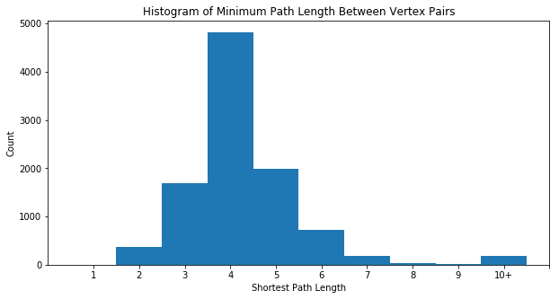
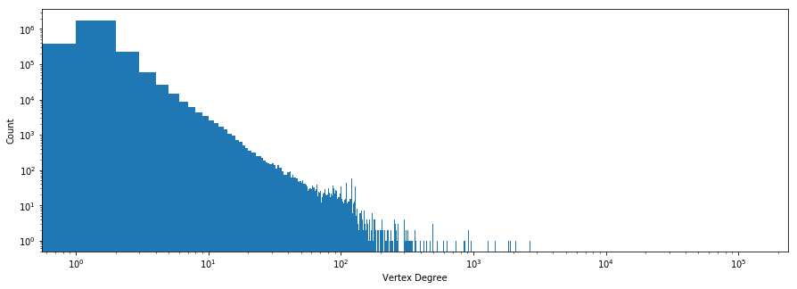
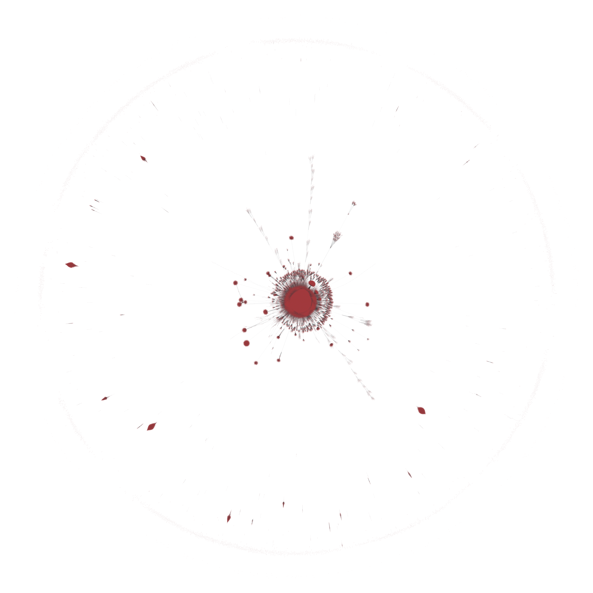

# Introduction

In this kernel we will explore the interconnectedness of addresses on the Ethereum Classic blockchain when viewed as a directed graph where each vertex represents an address and edges connect addresses that have transacted. To achieve this, we will leverage the module [graph-tool](https://graph-tool.skewed.de/), chosen for its performant C++ implementation and ability to visualize large graphs.


```python
import numpy as np
import pandas as pd
from google.cloud import bigquery

client = bigquery.Client()
query = """
SELECT from_address, 
    to_address
FROM `bigquery-public-data.crypto_ethereum_classic.transactions` 
GROUP BY from_address, to_address
ORDER BY from_address ASC   
    
"""
df = client.query(query).to_dataframe()
df.describe()
```

    Using Kaggle's public dataset BigQuery integration.


<div>
<style scoped>
    .dataframe tbody tr th:only-of-type {
        vertical-align: middle;
    }

    .dataframe tbody tr th {
        vertical-align: top;
    }

    .dataframe thead th {
        text-align: right;
    }
</style>
<table border="1" class="dataframe">
  <thead>
    <tr style="text-align: right;">
      <th></th>
      <th>from_address</th>
      <th>to_address</th>
    </tr>
  </thead>
  <tbody>
    <tr>
      <th>count</th>
      <td>5252244</td>
      <td>5229992</td>
    </tr>
    <tr>
      <th>unique</th>
      <td>2152900</td>
      <td>2458691</td>
    </tr>
    <tr>
      <th>top</th>
      <td>0xe592b0d8baa2cb677034389b76a71b0d1823e0d1</td>
      <td>0x8837234b8d27cf4abdae353264f45c8866631ed5</td>
    </tr>
    <tr>
      <th>freq</th>
      <td>131711</td>
      <td>186200</td>
    </tr>
  </tbody>
</table>
</div>


We can see that there is a discrepancy between the to and from address columns, implying that there are `None` values present in the data. Without prior knowledge explaining the presence of these, the only choice is to drop them from the dataframe


```python
df = df.dropna()
df.describe()
```


<div>
<style scoped>
    .dataframe tbody tr th:only-of-type {
        vertical-align: middle;
    }

    .dataframe tbody tr th {
        vertical-align: top;
    }

    .dataframe thead th {
        text-align: right;
    }
</style>
<table border="1" class="dataframe">
  <thead>
    <tr style="text-align: right;">
      <th></th>
      <th>from_address</th>
      <th>to_address</th>
    </tr>
  </thead>
  <tbody>
    <tr>
      <th>count</th>
      <td>5229992</td>
      <td>5229992</td>
    </tr>
    <tr>
      <th>unique</th>
      <td>2139201</td>
      <td>2458691</td>
    </tr>
    <tr>
      <th>top</th>
      <td>0xe592b0d8baa2cb677034389b76a71b0d1823e0d1</td>
      <td>0x8837234b8d27cf4abdae353264f45c8866631ed5</td>
    </tr>
    <tr>
      <th>freq</th>
      <td>131711</td>
      <td>186200</td>
    </tr>
  </tbody>
</table>
</div>


Here is where we install graph-tool


```python
!conda install --yes --override-channels -c ostrokach-forge -c pkgw-forge -c conda-forge gtk3 pygobject graph-tool
```

    Collecting package metadata: - \ | / - \ | / - \ | / - \ | / - \ | / - \ | / - \ | / - \ | / - \ | / - \ | / - \ | / - \ | / - \ | / - \ | / - \ | / - \ | / - \ | / - \ | / - \ | / - \ | / - \ | / - \ | / - \ | / - \ | / - \ | / - \ | / - \ | / - \ | / - \ | / - \ | / - \ done
    Solving environment: / - \ | / - \ | / - \ | / - \ | / - \ | 
    The environment is inconsistent, please check the package plan carefully
    The following packages are causing the inconsistency:
    
      - defaults/linux-64::pkginfo==1.4.2=py36_1
      - defaults/linux-64::anaconda-client==1.6.14=py36_0
      - defaults/linux-64::jupyterlab_launcher==0.10.5=py36_0
      - defaults/linux-64::pyparsing==2.2.0=py36hee85983_1
      - defaults/linux-64::jpeg==9b=h024ee3a_2
      - defaults/linux-64::xlsxwriter==1.0.4=py36_0
      - defaults/linux-64::sphinxcontrib==1.0=py36h6d0f590_1
      - defaults/linux-64::sympy==1.1.1=py36hc6d1c1c_0
      - defaults/linux-64::tblib==1.3.2=py36h34cf8b6_0
      - defaults/linux-64::unicodecsv==0.14.1=py36ha668878_0
      - defaults/linux-64::idna==2.6=py36h82fb2a8_1
      - defaults/linux-64::terminado==0.8.1=py36_1
      - defaults/linux-64::jupyter_client==5.2.3=py36_0
      - defaults/linux-64::py==1.5.3=py36_0
      - defaults/linux-64::nltk==3.3.0=py36_0
      - defaults/linux-64::simplegeneric==0.8.1=py36_2
      - defaults/linux-64::conda-build==3.10.5=py36_0
      - defaults/linux-64::libtiff==4.0.9=he85c1e1_1
      - defaults/linux-64::chardet==3.0.4=py36h0f667ec_1
      - defaults/linux-64::libtool==2.4.6=h544aabb_3
      - defaults/linux-64::numexpr==2.6.5=py36h7bf3b9c_0
      - defaults/linux-64::filelock==3.0.4=py36_0
      - defaults/linux-64::more-itertools==4.1.0=py36_0
      - defaults/linux-64::rope==0.10.7=py36h147e2ec_0
      - defaults/linux-64::itsdangerous==0.24=py36h93cc618_1
      - defaults/linux-64::cython==0.28.2=py36h14c3975_0
      - defaults/linux-64::_ipyw_jlab_nb_ext_conf==0.1.0=py36he11e457_0
      - defaults/linux-64::ipywidgets==7.2.1=py36_0
      - defaults/linux-64::scipy==1.1.0=py36hfc37229_0
      - defaults/linux-64::fastcache==1.0.2=py36h14c3975_2
      - defaults/linux-64::distributed==1.21.8=py36_0
      - defaults/linux-64::alabaster==0.7.10=py36h306e16b_0
      - defaults/linux-64::xlrd==1.1.0=py36h1db9f0c_1
      - defaults/linux-64::glob2==0.6=py36he249c77_0
      - defaults/linux-64::mkl-service==1.1.2=py36h17a0993_4
      - defaults/linux-64::snappy==1.1.7=hbae5bb6_3
      - defaults/linux-64::pickleshare==0.7.4=py36h63277f8_0
      - defaults/linux-64::locket==0.2.0=py36h787c0ad_1
      - defaults/linux-64::sortedcontainers==1.5.10=py36_0
      - defaults/linux-64::datashape==0.5.4=py36h3ad6b5c_0
      - defaults/linux-64::pillow==5.1.0=py36h3deb7b8_0
      - defaults/linux-64::pycodestyle==2.4.0=py36_0
      - defaults/linux-64::pandoc==1.19.2.1=hea2e7c5_1
      - defaults/linux-64::spyder==3.2.8=py36_0
      - defaults/linux-64::qt==5.9.5=h7e424d6_0
      - defaults/linux-64::lazy-object-proxy==1.3.1=py36h10fcdad_0
      - defaults/linux-64::gst-plugins-base==1.14.0=hbbd80ab_1
      - defaults/linux-64::requests==2.18.4=py36he2e5f8d_1
      - defaults/linux-64::bottleneck==1.2.1=py36haac1ea0_0
      - defaults/linux-64::ipython==6.4.0=py36_0
      - defaults/linux-64::attrs==18.1.0=py36_0
      - defaults/linux-64::prompt_toolkit==1.0.15=py36h17d85b1_0
      - defaults/linux-64::typing==3.6.4=py36_0
      - defaults/linux-64::python-dateutil==2.7.3=py36_0
      - defaults/linux-64::ruamel_yaml==0.15.35=py36h14c3975_1
      - defaults/linux-64::docutils==0.14=py36hb0f60f5_0
      - defaults/linux-64::get_terminal_size==1.0.0=haa9412d_0
      - defaults/linux-64::odo==0.5.1=py36h90ed295_0
      - defaults/linux-64::babel==2.5.3=py36_0
      - defaults/linux-64::jupyter==1.0.0=py36_4
      - defaults/linux-64::bkcharts==0.2=py36h735825a_0
      - defaults/linux-64::scikit-learn==0.19.1=py36h7aa7ec6_0
      - defaults/linux-64::jupyter_console==5.2.0=py36he59e554_1
      - defaults/linux-64::nose==1.3.7=py36hcdf7029_2
      - defaults/linux-64::nbformat==4.4.0=py36h31c9010_0
      - defaults/linux-64::mpmath==1.0.0=py36hfeacd6b_2
      - defaults/linux-64::harfbuzz==1.7.6=h5f0a787_1
      - defaults/linux-64::parso==0.2.0=py36_0
      - defaults/linux-64::sqlalchemy==1.2.7=py36h6b74fdf_0
      - defaults/linux-64::openpyxl==2.5.3=py36_0
      - defaults/linux-64::imagesize==1.0.0=py36_0
      - defaults/linux-64::xlwt==1.3.0=py36h7b00a1f_0
      - defaults/linux-64::yaml==0.1.7=had09818_2
      - defaults/linux-64::et_xmlfile==1.0.1=py36hd6bccc3_0
      - defaults/linux-64::pytz==2018.4=py36_0
      - defaults/linux-64::mccabe==0.6.1=py36h5ad9710_1
      - defaults/linux-64::flask==1.0.2=py36_1
      - defaults/linux-64::heapdict==1.0.0=py36_2
      - defaults/linux-64::path.py==11.0.1=py36_0
      - defaults/linux-64::numpydoc==0.8.0=py36_0
      - defaults/linux-64::colorama==0.3.9=py36h489cec4_0
      - defaults/linux-64::urllib3==1.22=py36hbe7ace6_0
      - defaults/linux-64::pytest-openfiles==0.3.0=py36_0
      - defaults/linux-64::backports==1.0=py36hfa02d7e_1
      - defaults/linux-64::widgetsnbextension==3.2.1=py36_0
      - defaults/linux-64::ply==3.11=py36_0
      - defaults/linux-64::pathlib2==2.3.2=py36_0
      - defaults/linux-64::patsy==0.5.0=py36_0
      - defaults/linux-64::cloudpickle==0.5.3=py36_0
      - defaults/linux-64::traitlets==4.3.2=py36h674d592_0
      - defaults/linux-64::pixman==0.34.0=hceecf20_3
      - defaults/linux-64::jinja2==2.10=py36ha16c418_0
      - defaults/linux-64::ipython_genutils==0.2.0=py36hb52b0d5_0
      - defaults/linux-64::pytest-astropy==0.3.0=py36_0
      - defaults/linux-64::libcurl==7.60.0=h1ad7b7a_0
      - defaults/linux-64::libxslt==1.1.32=h1312cb7_0
      - defaults/linux-64::bleach==2.1.3=py36_0
      - defaults/linux-64::greenlet==0.4.13=py36h14c3975_0
      - defaults/linux-64::send2trash==1.5.0=py36_0
      - defaults/linux-64::sphinxcontrib-websupport==1.0.1=py36hb5cb234_1
      - defaults/linux-64::notebook==5.5.0=py36_0
      - defaults/linux-64::cycler==0.10.0=py36h93f1223_0
      - defaults/linux-64::werkzeug==0.14.1=py36_0
      - defaults/linux-64::pygments==2.2.0=py36h0d3125c_0
      - defaults/linux-64::icu==58.2=h9c2bf20_1
      - defaults/linux-64::sortedcollections==0.6.1=py36_0
      - defaults/linux-64::setuptools==39.1.0=py36_0
      - defaults/linux-64::beautifulsoup4==4.6.0=py36h49b8c8c_1
      - defaults/linux-64::mpc==1.0.3=hec55b23_5
      - defaults/linux-64::pylint==1.8.4=py36_0
      - defaults/linux-64::mkl_random==1.0.1=py36h629b387_0
      - defaults/linux-64::numba==0.38.0=py36h637b7d7_0
      - defaults/linux-64::decorator==4.3.0=py36_0
      - defaults/linux-64::pycurl==7.43.0.1=py36hb7f436b_0
      - defaults/linux-64::jdcal==1.4=py36_0
      - defaults/linux-64::qtpy==1.4.1=py36_0
      - defaults/linux-64::webencodings==0.5.1=py36h800622e_1
      - defaults/linux-64::msgpack-python==0.5.6=py36h6bb024c_0
      - defaults/linux-64::ptyprocess==0.5.2=py36h69acd42_0
      - defaults/linux-64::testpath==0.3.1=py36h8cadb63_0
      - defaults/linux-64::freetype==2.8=hab7d2ae_1
      - defaults/linux-64::contextlib2==0.5.5=py36h6c84a62_0
      - defaults/linux-64::snowballstemmer==1.2.1=py36h6febd40_0
      - defaults/linux-64::scikit-image==0.13.1=py36h14c3975_1
      - defaults/linux-64::statsmodels==0.9.0=py36h3010b51_0
      - defaults/linux-64::pango==1.41.0=hd475d92_0
      - defaults/linux-64::pandocfilters==1.4.2=py36ha6701b7_1
      - defaults/linux-64::backports.shutil_get_terminal_size==1.0.0=py36hfea85ff_2
      - defaults/linux-64::pytest-arraydiff==0.2=py36_0
      - defaults/linux-64::packaging==17.1=py36_0
      - defaults/linux-64::pexpect==4.5.0=py36_0
      - defaults/linux-64::isort==4.3.4=py36_0
      - defaults/linux-64::clyent==1.2.2=py36h7e57e65_1
      - defaults/linux-64::curl==7.60.0=h84994c4_0
      - defaults/linux-64::markupsafe==1.0=py36hd9260cd_1
      - defaults/linux-64::jupyter_core==4.4.0=py36h7c827e3_0
      - defaults/linux-64::libffi==3.2.1=hd88cf55_4
      - defaults/linux-64::anaconda-project==0.8.2=py36h44fb852_0
      - defaults/linux-64::navigator-updater==0.2.1=py36_0
      - defaults/linux-64::pycparser==2.18=py36hf9f622e_1
      - defaults/linux-64::readline==7.0=ha6073c6_4
      - defaults/linux-64::pytest-remotedata==0.2.1=py36_0
      - defaults/linux-64::nbconvert==5.3.1=py36hb41ffb7_0
      - defaults/linux-64::multipledispatch==0.5.0=py36_0
      - defaults/linux-64::pycrypto==2.6.1=py36h14c3975_8
      - defaults/linux-64::pip==10.0.1=py36_0
      - defaults/linux-64::pyodbc==4.0.23=py36hf484d3e_0
      - defaults/linux-64::fontconfig==2.12.6=h49f89f6_0
      - defaults/linux-64::boto==2.48.0=py36h6e4cd66_1
      - defaults/linux-64::pyyaml==3.12=py36hafb9ca4_1
      - defaults/linux-64::glib==2.56.1=h000015b_0
      - defaults/linux-64::sphinx==1.7.4=py36_0
      - defaults/linux-64::pandas==0.23.0=py36h637b7d7_0
      - defaults/linux-64::lxml==4.2.1=py36h23eabaa_0
      - defaults/linux-64::llvmlite==0.23.1=py36hdbcaa40_0
      - defaults/linux-64::pytest==3.5.1=py36_0
      - defaults/linux-64::cryptography==2.2.2=py36h14c3975_0
      - defaults/linux-64::kiwisolver==1.0.1=py36h764f252_0
      - defaults/linux-64::html5lib==1.0.1=py36h2f9c1c0_0
      - defaults/linux-64::toolz==0.9.0=py36_0
      - defaults/linux-64::cytoolz==0.9.0.1=py36h14c3975_0
      - defaults/linux-64::pyopenssl==18.0.0=py36_0
      - defaults/linux-64::pyzmq==17.0.0=py36h14c3975_0
      - defaults/linux-64::dbus==1.13.2=h714fa37_1
      - defaults/linux-64::wcwidth==0.1.7=py36hdf4376a_0
      - defaults/linux-64::olefile==0.45.1=py36_0
      - defaults/linux-64::zlib==1.2.11=ha838bed_2
      - defaults/linux-64::partd==0.3.8=py36h36fd896_0
      - defaults/linux-64::backcall==0.1.0=py36_0
      - defaults/linux-64::zict==0.1.3=py36h3a3bf81_0
      - defaults/linux-64::click==6.7=py36h5253387_0
      - defaults/linux-64::cairo==1.14.12=h7636065_2
      - defaults/linux-64::tornado==5.0.2=py36_0
      - defaults/linux-64::jsonschema==2.6.0=py36h006f8b5_0
      - defaults/linux-64::expat==2.2.5=he0dffb1_0
      - defaults/linux-64::astropy==3.0.2=py36h3010b51_1
      - defaults/linux-64::wheel==0.31.1=py36_0
      - defaults/linux-64::pycosat==0.6.3=py36h0a5515d_0
      - defaults/linux-64::qtconsole==4.3.1=py36h8f73b5b_0
      - defaults/linux-64::bitarray==0.8.1=py36h14c3975_1
      - defaults/linux-64::pep8==1.7.1=py36_0
      - defaults/linux-64::dask==0.17.5=py36_0
      - defaults/linux-64::dask-core==0.17.5=py36_0
      - defaults/linux-64::conda-verify==2.0.0=py36h98955d8_0
      - defaults/linux-64::mpfr==3.1.5=h11a74b3_2
      - defaults/linux-64::lzo==2.10=h49e0be7_2
      - defaults/linux-64::jedi==0.12.0=py36_1
      - defaults/linux-64::imageio==2.3.0=py36_0
      - defaults/linux-64::sip==4.19.8=py36hf484d3e_0
      - defaults/linux-64::astroid==1.6.3=py36_0
      - defaults/linux-64::wrapt==1.10.11=py36h28b7045_0
      - defaults/linux-64::pyflakes==1.6.0=py36h7bd6a15_0
      - defaults/linux-64::flask-cors==3.0.4=py36_0
      - defaults/linux-64::asn1crypto==0.24.0=py36_0
      - defaults/linux-64::psutil==5.4.5=py36h14c3975_0
      - defaults/linux-64::six==1.11.0=py36h372c433_1
      - defaults/linux-64::gmpy2==2.0.8=py36hc8893dd_2
      - defaults/linux-64::singledispatch==3.4.0.3=py36h7a266c3_0
      - defaults/linux-64::blaze==0.11.3=py36h4e06776_0
      - defaults/linux-64::matplotlib==2.2.2=py36h0e671d2_1
      - defaults/linux-64::qtawesome==0.4.4=py36h609ed8c_0
      - defaults/linux-64::mistune==0.8.3=py36h14c3975_1
      - defaults/linux-64::anaconda-navigator==1.8.7=py36_0
      - defaults/linux-64::pluggy==0.6.0=py36hb689045_0
      - defaults/linux-64::pysocks==1.6.8=py36_0
      - defaults/linux-64::seaborn==0.8.1=py36hfad7ec4_0
      - defaults/linux-64::gevent==1.3.0=py36h14c3975_0
      - defaults/linux-64::pytest-doctestplus==0.1.3=py36_0
      - defaults/linux-64::libxml2==2.9.8=h26e45fe_1
      - defaults/linux-64::cffi==1.11.5=py36h9745a5d_0
      - defaults/linux-64::pywavelets==0.5.2=py36he602eb0_0
      - defaults/linux-64::ipykernel==4.8.2=py36_0
      - defaults/linux-64::gmp==6.1.2=h6c8ec71_1
      - defaults/linux-64::entrypoints==0.2.3=py36h1aec115_2
      - defaults/linux-64::gstreamer==1.14.0=hb453b48_1
      - defaults/linux-64::jupyterlab==0.32.1=py36_0
      - defaults/linux-64::libpng==1.6.34=hb9fc6fc_0
      - defaults/linux-64::pyqt==5.9.2=py36h751905a_0
      - defaults/linux-64::networkx==2.1=py36_0
      - defaults/linux-64::boost==1.65.1=py36_4
      - defaults/linux-64::libboost==1.65.1=habcd387_4
      - defaults/linux-64::py-boost==1.65.1=py36hf484d3e_4
      - defaults/linux-64::cvxcanon==0.1.1=py36h04863e7_0
      - defaults/linux-64::ecos==2.0.5=py36h3010b51_0
      - defaults/linux-64::blosc==1.15.0=hd408876_0
      - defaults/linux-64::ninja==1.9.0=py36hfd86e86_0
      - defaults/linux-64::hdf5==1.10.4=hb1b8bf9_0
      - pytorch/noarch::torchvision-cpu==0.2.2=py_3
      - defaults/linux-64::pytables==3.5.1=py36h71ec239_0
      - defaults/linux-64::h5py==2.9.0=py36h7918eee_0
      - pytorch/linux-64::pytorch-cpu==1.0.1=py3.6_cpu_2
      - bokeh/noarch::bokeh==1.1.0=py_0
      - defaults/noarch::futures-compat==1.0=py3_0
      - defaults/linux-64::conda==4.6.14=py36_0
      - defaults/linux-64::certifi==2019.3.9=py36_0
      - defaults/linux-64::pyshp==2.0.1=py36_0
      - defaults/linux-64::basemap==1.2.0=py36h705c2d8_0
      - defaults/linux-64::pyproj==1.9.6=py36h14380d9_0
      - conda-forge/linux-64::igraph==0.7.1=h2166141_1005
      - conda-forge/linux-64::pycairo==1.18.0=py36h1b9232e_1000
      - conda-forge/linux-64::python-igraph==0.7.1.post7=py36h516909a_0
      - conda-forge/linux-64::murmurhash==1.0.0=py36hfc679d8_0
      - defaults/linux-64::cymem==2.0.2=py36hfd86e86_0
      - conda-forge/linux-64::mkl_fft==1.0.10=py36_0
      - conda-forge/linux-64::spacy==2.1.3=py36hc9558a2_0
      - conda-forge/noarch::wasabi==0.2.1=py_0
      - conda-forge/linux-64::thinc==7.0.4=py36hc9558a2_0
      - defaults/linux-64::preshed==2.0.1=py36he6710b0_0
      - conda-forge/linux-64::srsly==0.0.5=py36hf484d3e_0
      - conda-forge/noarch::plac==0.9.6=py_1
      - defaults/linux-64::numpy==1.15.4=py36h1d66e8a_0
      - conda-forge/noarch::tqdm==4.31.1=py_0
      - defaults/linux-64::numpy-base==1.15.4=py36h81de0dd_0
      - conda-forge/linux-64::cython-blis==0.2.4=py36h516909a_0
      - defaults/linux-64::tk==8.6.8=hbc83047_0
      - defaults/linux-64::python==3.6.6=h6e4f718_2
    / - \ | / - \ | / - \ | / - \ | / - \ | / - \ | / - \ | / - \ | / - \ | done
    
    ## Package Plan ##
    
      environment location: /opt/conda
    
      added / updated specs:
        - graph-tool
        - gtk3
        - pygobject
    
    
    The following packages will be downloaded:
    
        package                    |            build
        ---------------------------|-----------------
        at-spi2-atk-2.26.2         |       h9b4a0fc_1          78 KB  ostrokach-forge
        at-spi2-core-2.28.0        |       h9b4a0fc_1         508 KB  ostrokach-forge
        atk-2.25.90                |    hf2eb9ee_1001         430 KB  conda-forge
        boost-1.69.0               |py36h8619c78_1001         302 KB  conda-forge
        boost-cpp-1.69.0           |    h11c811c_1000        20.7 MB  conda-forge
        cairo-1.14.12              |    h80bd089_1005         1.4 MB  conda-forge
        cairomm-1.12.2             |       h1bf91d6_1         666 KB  ostrokach-forge
        cgal-4.12.1                |   py36h829e1a8_6         6.0 MB  ostrokach-forge
        epoxy-1.5.2                |       h14c3975_1         454 KB  ostrokach-forge
        expat-2.2.5                |    hf484d3e_1002         185 KB  conda-forge
        fontconfig-2.13.1          |    he4413a7_1000         327 KB  conda-forge
        freetype-2.9.1             |    h94bbf69_1005         827 KB  conda-forge
        gdk-pixbuf-2.36.12         |    h4f1c04b_1001         598 KB  conda-forge
        gettext-0.19.8.1           |    hc5be6a0_1002         3.6 MB  conda-forge
        glib-2.56.2                |    had28632_1001         4.7 MB  conda-forge
        gmp-6.1.2                  |    hf484d3e_1000         751 KB  conda-forge
        gobject-introspection-1.56.1|py36h9e29830_1001         1.3 MB  conda-forge
        graph-tool-2.28.dev0       |   py36h0dcec27_0       120.1 MB  ostrokach-forge
        gstreamer-1.12.5           |    h0cc0488_1000         3.7 MB  conda-forge
        gtk2-2.24.31               |    h5baeb44_1000         7.3 MB  conda-forge
        gtk3-3.22.30               |       h2c0c718_1         9.2 MB  ostrokach-forge
        harfbuzz-1.9.0             |    he243708_1001         957 KB  conda-forge
        icu-58.2                   |    hf484d3e_1000        22.6 MB  conda-forge
        jpeg-9c                    |    h14c3975_1001         251 KB  conda-forge
        kiwisolver-1.1.0           |   py36hc9558a2_0          86 KB  conda-forge
        libcroco-0.6.12            |    h468c787_1001         136 KB  conda-forge
        libffi-3.2.1               |    he1b5a44_1006          46 KB  conda-forge
        libpng-1.6.37              |       hed695b0_0         343 KB  conda-forge
        librsvg-2.40.19            |    h84fa2a2_1000         136 KB  conda-forge
        libsigcpp-2.10.0           |       hf484d3e_0         3.6 MB  ostrokach-forge
        libuuid-2.32.1             |    h14c3975_1000          26 KB  conda-forge
        matplotlib-3.0.3           |           py36_1           6 KB  conda-forge
        matplotlib-base-3.0.3      |   py36h5f35d83_1         6.7 MB  conda-forge
        mpfr-4.0.2                 |       ha14ba45_0         678 KB  conda-forge
        pango-1.40.14              |    hf0c64fd_1003         532 KB  conda-forge
        pixman-0.34.0              |    h14c3975_1003         595 KB  conda-forge
        pygobject-3.28.3           |py36h89f6ae1_1001         275 KB  conda-forge
        pyqt-5.6.0                 |py36h13b7fb3_1008         5.4 MB  conda-forge
        qt-5.6.2                   |    hbe13537_1012        44.5 MB  conda-forge
        readline-7.0               |    hf8c457e_1001         391 KB  conda-forge
        sip-4.18.1                 |py36hf484d3e_1000         277 KB  conda-forge
        sparsehash-2.0.3           |       h6bb024c_0          85 KB  ostrokach-forge
        tk-8.6.9                   |    h84994c4_1001         3.2 MB  conda-forge
        xorg-fixesproto-5.0        |    h14c3975_1002           8 KB  conda-forge
        xorg-inputproto-2.3.2      |    h14c3975_1002          18 KB  conda-forge
        xorg-kbproto-1.0.7         |    h14c3975_1002          26 KB  conda-forge
        xorg-libice-1.0.9          |    h516909a_1004          58 KB  conda-forge
        xorg-libsm-1.2.3           |    h84519dc_1000          25 KB  conda-forge
        xorg-libx11-1.6.7          |    h14c3975_1000         940 KB  conda-forge
        xorg-libxext-1.3.4         |       h516909a_0          51 KB  conda-forge
        xorg-libxfixes-5.0.3       |    h516909a_1004          17 KB  conda-forge
        xorg-libxi-1.7.9           |    h516909a_1002          45 KB  conda-forge
        xorg-libxrender-0.9.10     |    h516909a_1002          31 KB  conda-forge
        xorg-libxt-1.1.5           |    h14c3975_1002         367 KB  conda-forge
        xorg-libxtst-1.2.3         |    h14c3975_1002          30 KB  conda-forge
        xorg-recordproto-1.14.2    |    h14c3975_1002           7 KB  conda-forge
        xorg-renderproto-0.11.1    |    h14c3975_1002           8 KB  conda-forge
        xorg-xextproto-7.3.0       |    h14c3975_1002          27 KB  conda-forge
        xorg-xproto-7.0.31         |    h14c3975_1007          72 KB  conda-forge
        zlib-1.2.11                |    h14c3975_1004         101 KB  conda-forge
        ------------------------------------------------------------
                                               Total:       275.3 MB
    
    The following NEW packages will be INSTALLED:
    
      at-spi2-atk        ostrokach-forge/linux-64::at-spi2-atk-2.26.2-h9b4a0fc_1
      at-spi2-core       ostrokach-forge/linux-64::at-spi2-core-2.28.0-h9b4a0fc_1
      atk                conda-forge/linux-64::atk-2.25.90-hf2eb9ee_1001
      boost-cpp          conda-forge/linux-64::boost-cpp-1.69.0-h11c811c_1000
      cairomm            ostrokach-forge/linux-64::cairomm-1.12.2-h1bf91d6_1
      cgal               ostrokach-forge/linux-64::cgal-4.12.1-py36h829e1a8_6
      epoxy              ostrokach-forge/linux-64::epoxy-1.5.2-h14c3975_1
      gdk-pixbuf         conda-forge/linux-64::gdk-pixbuf-2.36.12-h4f1c04b_1001
      gettext            conda-forge/linux-64::gettext-0.19.8.1-hc5be6a0_1002
      gobject-introspec~ conda-forge/linux-64::gobject-introspection-1.56.1-py36h9e29830_1001
      graph-tool         ostrokach-forge/linux-64::graph-tool-2.28.dev0-py36h0dcec27_0
      gtk2               conda-forge/linux-64::gtk2-2.24.31-h5baeb44_1000
      gtk3               ostrokach-forge/linux-64::gtk3-3.22.30-h2c0c718_1
      libcroco           conda-forge/linux-64::libcroco-0.6.12-h468c787_1001
      librsvg            conda-forge/linux-64::librsvg-2.40.19-h84fa2a2_1000
      libsigcpp          ostrokach-forge/linux-64::libsigcpp-2.10.0-hf484d3e_0
      libuuid            conda-forge/linux-64::libuuid-2.32.1-h14c3975_1000
      matplotlib-base    conda-forge/linux-64::matplotlib-base-3.0.3-py36h5f35d83_1
      pygobject          conda-forge/linux-64::pygobject-3.28.3-py36h89f6ae1_1001
      sparsehash         ostrokach-forge/linux-64::sparsehash-2.0.3-h6bb024c_0
      xorg-fixesproto    conda-forge/linux-64::xorg-fixesproto-5.0-h14c3975_1002
      xorg-inputproto    conda-forge/linux-64::xorg-inputproto-2.3.2-h14c3975_1002
      xorg-kbproto       conda-forge/linux-64::xorg-kbproto-1.0.7-h14c3975_1002
      xorg-libice        conda-forge/linux-64::xorg-libice-1.0.9-h516909a_1004
      xorg-libsm         conda-forge/linux-64::xorg-libsm-1.2.3-h84519dc_1000
      xorg-libx11        conda-forge/linux-64::xorg-libx11-1.6.7-h14c3975_1000
      xorg-libxext       conda-forge/linux-64::xorg-libxext-1.3.4-h516909a_0
      xorg-libxfixes     conda-forge/linux-64::xorg-libxfixes-5.0.3-h516909a_1004
      xorg-libxi         conda-forge/linux-64::xorg-libxi-1.7.9-h516909a_1002
      xorg-libxrender    conda-forge/linux-64::xorg-libxrender-0.9.10-h516909a_1002
      xorg-libxt         conda-forge/linux-64::xorg-libxt-1.1.5-h14c3975_1002
      xorg-libxtst       conda-forge/linux-64::xorg-libxtst-1.2.3-h14c3975_1002
      xorg-recordproto   conda-forge/linux-64::xorg-recordproto-1.14.2-h14c3975_1002
      xorg-renderproto   conda-forge/linux-64::xorg-renderproto-0.11.1-h14c3975_1002
      xorg-xextproto     conda-forge/linux-64::xorg-xextproto-7.3.0-h14c3975_1002
      xorg-xproto        conda-forge/linux-64::xorg-xproto-7.0.31-h14c3975_1007
    
    The following packages will be UPDATED:
    
      boost                      pkgs/main::boost-1.65.1-py36_4 --> conda-forge::boost-1.69.0-py36h8619c78_1001
      cairo                 pkgs/main::cairo-1.14.12-h7636065_2 --> conda-forge::cairo-1.14.12-h80bd089_1005
      expat                   pkgs/main::expat-2.2.5-he0dffb1_0 --> conda-forge::expat-2.2.5-hf484d3e_1002
      fontconfig         pkgs/main::fontconfig-2.12.6-h49f89f6~ --> conda-forge::fontconfig-2.13.1-he4413a7_1000
      freetype               pkgs/main::freetype-2.8-hab7d2ae_1 --> conda-forge::freetype-2.9.1-h94bbf69_1005
      glib                    pkgs/main::glib-2.56.1-h000015b_0 --> conda-forge::glib-2.56.2-had28632_1001
      gmp                       pkgs/main::gmp-6.1.2-h6c8ec71_1 --> conda-forge::gmp-6.1.2-hf484d3e_1000
      harfbuzz             pkgs/main::harfbuzz-1.7.6-h5f0a787_1 --> conda-forge::harfbuzz-1.9.0-he243708_1001
      icu                        pkgs/main::icu-58.2-h9c2bf20_1 --> conda-forge::icu-58.2-hf484d3e_1000
      jpeg                        pkgs/main::jpeg-9b-h024ee3a_2 --> conda-forge::jpeg-9c-h14c3975_1001
      kiwisolver         pkgs/main::kiwisolver-1.0.1-py36h764f~ --> conda-forge::kiwisolver-1.1.0-py36hc9558a2_0
      libffi                 pkgs/main::libffi-3.2.1-hd88cf55_4 --> conda-forge::libffi-3.2.1-he1b5a44_1006
      libpng                pkgs/main::libpng-1.6.34-hb9fc6fc_0 --> conda-forge::libpng-1.6.37-hed695b0_0
      matplotlib         pkgs/main::matplotlib-2.2.2-py36h0e67~ --> conda-forge::matplotlib-3.0.3-py36_1
      mpfr                     pkgs/main::mpfr-3.1.5-h11a74b3_2 --> conda-forge::mpfr-4.0.2-ha14ba45_0
      pixman                pkgs/main::pixman-0.34.0-hceecf20_3 --> conda-forge::pixman-0.34.0-h14c3975_1003
      readline               pkgs/main::readline-7.0-ha6073c6_4 --> conda-forge::readline-7.0-hf8c457e_1001
      tk                         pkgs/main::tk-8.6.8-hbc83047_0 --> conda-forge::tk-8.6.9-h84994c4_1001
      zlib                    pkgs/main::zlib-1.2.11-ha838bed_2 --> conda-forge::zlib-1.2.11-h14c3975_1004
    
    The following packages will be SUPERSEDED by a higher-priority channel:
    
      gstreamer          pkgs/main::gstreamer-1.14.0-hb453b48_1 --> conda-forge::gstreamer-1.12.5-h0cc0488_1000
      pango                  pkgs/main::pango-1.41.0-hd475d92_0 --> conda-forge::pango-1.40.14-hf0c64fd_1003
      pyqt                 pkgs/main::pyqt-5.9.2-py36h751905a_0 --> conda-forge::pyqt-5.6.0-py36h13b7fb3_1008
      qt                         pkgs/main::qt-5.9.5-h7e424d6_0 --> conda-forge::qt-5.6.2-hbe13537_1012
      sip                  pkgs/main::sip-4.19.8-py36hf484d3e_0 --> conda-forge::sip-4.18.1-py36hf484d3e_1000
    
    
    
    Downloading and Extracting Packages
    xorg-libxfixes-5.0.3 | 17 KB     | ##################################### | 100% 
    fontconfig-2.13.1    | 327 KB    | ##################################### | 100% 
    libcroco-0.6.12      | 136 KB    | ##################################### | 100% 
    xorg-libxtst-1.2.3   | 30 KB     | ##################################### | 100% 
    sparsehash-2.0.3     | 85 KB     | ##################################### | 100% 
    jpeg-9c              | 251 KB    | ##################################### | 100% 
    libsigcpp-2.10.0     | 3.6 MB    | ##################################### | 100% 
    xorg-kbproto-1.0.7   | 26 KB     | ##################################### | 100% 
    libuuid-2.32.1       | 26 KB     | ##################################### | 100% 
    xorg-libice-1.0.9    | 58 KB     | ##################################### | 100% 
    pygobject-3.28.3     | 275 KB    | ##################################### | 100% 
    kiwisolver-1.1.0     | 86 KB     | ##################################### | 100% 
    xorg-xextproto-7.3.0 | 27 KB     | ##################################### | 100% 
    cgal-4.12.1          | 6.0 MB    | ##################################### | 100% 
    xorg-recordproto-1.1 | 7 KB      | ##################################### | 100% 
    readline-7.0         | 391 KB    | ##################################### | 100% 
    atk-2.25.90          | 430 KB    | ##################################### | 100% 
    mpfr-4.0.2           | 678 KB    | ##################################### | 100% 
    cairo-1.14.12        | 1.4 MB    | ##################################### | 100% 
    at-spi2-atk-2.26.2   | 78 KB     | ##################################### | 100% 
    boost-cpp-1.69.0     | 20.7 MB   | ##################################### | 100% 
    xorg-libsm-1.2.3     | 25 KB     | ##################################### | 100% 
    xorg-libx11-1.6.7    | 940 KB    | ##################################### | 100% 
    matplotlib-3.0.3     | 6 KB      | ##################################### | 100% 
    gtk2-2.24.31         | 7.3 MB    | ##################################### | 100% 
    pango-1.40.14        | 532 KB    | ##################################### | 100% 
    xorg-libxt-1.1.5     | 367 KB    | ##################################### | 100% 
    matplotlib-base-3.0. | 6.7 MB    | ##################################### | 100% 
    xorg-xproto-7.0.31   | 72 KB     | ##################################### | 100% 
    xorg-fixesproto-5.0  | 8 KB      | ##################################### | 100% 
    gobject-introspectio | 1.3 MB    | ##################################### | 100% 
    boost-1.69.0         | 302 KB    | ##################################### | 100% 
    gettext-0.19.8.1     | 3.6 MB    | ##################################### | 100% 
    at-spi2-core-2.28.0  | 508 KB    | ##################################### | 100% 
    qt-5.6.2             | 44.5 MB   | ##################################### | 100% 
    freetype-2.9.1       | 827 KB    | ##################################### | 100% 
    icu-58.2             | 22.6 MB   | ##################################### | 100% 
    libpng-1.6.37        | 343 KB    | ##################################### | 100% 
    tk-8.6.9             | 3.2 MB    | ##################################### | 100% 
    xorg-renderproto-0.1 | 8 KB      | ##################################### | 100% 
    cairomm-1.12.2       | 666 KB    | ##################################### | 100% 
    libffi-3.2.1         | 46 KB     | ##################################### | 100% 
    glib-2.56.2          | 4.7 MB    | ##################################### | 100% 
    xorg-libxi-1.7.9     | 45 KB     | ##################################### | 100% 
    gmp-6.1.2            | 751 KB    | ##################################### | 100% 
    pyqt-5.6.0           | 5.4 MB    | ##################################### | 100% 
    librsvg-2.40.19      | 136 KB    | ##################################### | 100% 
    epoxy-1.5.2          | 454 KB    | ##################################### | 100% 
    expat-2.2.5          | 185 KB    | ##################################### | 100% 
    harfbuzz-1.9.0       | 957 KB    | ##################################### | 100% 
    gdk-pixbuf-2.36.12   | 598 KB    | ##################################### | 100% 
    xorg-libxext-1.3.4   | 51 KB     | ##################################### | 100% 
    zlib-1.2.11          | 101 KB    | ##################################### | 100% 
    xorg-libxrender-0.9. | 31 KB     | ##################################### | 100% 
    graph-tool-2.28.dev0 | 120.1 MB  | ##################################### | 100% 
    xorg-inputproto-2.3. | 18 KB     | ##################################### | 100% 
    gstreamer-1.12.5     | 3.7 MB    | ##################################### | 100% 
    sip-4.18.1           | 277 KB    | ##################################### | 100% 
    gtk3-3.22.30         | 9.2 MB    | ##################################### | 100% 
    pixman-0.34.0        | 595 KB    | ##################################### | 100% 
    Preparing transaction: - \ | / - \ | / - \ | / - \ | / - done
    Verifying transaction: | / - \ | / - \ | / - \ | / - \ | / - \ | / - \ | / - \ | / - \ | / - \ | / - \ | / - \ | / - \ | / - \ | / - \ | / - \ | / - \ | / - \ | / - \ | / - \ | / - \ | / - \ | / - \ | / - \ | / - \ | / - \ | / - \ | / - \ | / - \ | / - \ | / - \ | / - \ | / - \ | / - \ | / - \ | / - \ | / - \ | / - \ | / - \ | / - \ | / - \ | / - \ | / - \ | / - \ | / - \ | / - \ | / - \ | / - \ | / - \ | / - \ | / - \ | / - \ | / - \ | / - \ | / - \ | / - \ | / - \ | / - \ | / - \ | / - \ | / - \ | / - \ | / - done
    Executing transaction: | / - \ | / - \ | / - \ | / - \ | / - \ | / - \ | / - \ | / - \ | / - \ | / - \ | / - \ | / - \ | / - \ | / - \ | / - \ | / - \ | / - \ | / - \ | / - \ | / - \ | / - \ | / - \ | / - \ | / - \ | / - \ | / - \ | / - \ | / - \ | / - \ | / - \ | / - \ | / - \ | / - \ | / - \ | / - \ | / - \ | / - \ | / - \ | / - \ | / - \ | / - \ | / - \ | / - \ | / - \ | / - \ | / - \ | / - \ | / - \ | / - \ | / - \ | / - \ | / - \ | / - \ | / - \ | / - \ | / - \ | / - \ | / - \ | / - \ | / - \ | / - \ | / - \ | / - \ | / - \ | / - \ | / - \ | / - \ | / - \ | / - \ | / - \ | / - \ | / - \ | / - \ | / - \ | / - \ | / - \ | / - \ | / - \ | / - \ | / - \ | / - \ | / - \ | / - \ | / - \ | / - \ | / - \ | / - \ | / - \ | / - \ | / - \ | / - \ | / - \ | / - \ | / - \ | / - \ | / - \ | / - \ | / - \ | / - \ | / - \ | / - \ | / - \ | / - \ | / - \ | / - \ | / - \ | / - \ | / - \ | / - \ | / - \ | / - \ | / - \ | / - \ | / - \ | / - \ | / - \ | / - \ | / - \ | / - \ | / - \ | / - \ | / - \ | / - \ | / - \ | / - \ | / - \ | / - \ | / - \ | / - \ | / - \ | / - \ | / - \ | / - \ | / - \ | / - \ | / - \ | / - \ | / - \ | / - \ | / - \ | / - \ | / - \ | / - \ | / - \ | / - \ | / - \ | / - \ | / - \ | / - \ | / - \ | / - \ | / - \ | / - \ | / - \ | / - \ | / - \ | / - \ | / - \ | / - \ | / - \ | / - \ | / - \ | / - \ | / - \ | / - \ | / - \ | / - \ | / - \ | / - \ | / - \ | / - \ | / - \ | / - \ | / - \ | / - \ | / - \ | / - \ | / - \ | / - \ | / - \ | / - \ | / - \ | / - \ | / - \ | / - \ | / - \ | / - \ | / - \ | / - \ | / - \ | / - \ | / - \ | / - \ | / - \ | / - \ | / - \ | / - \ | / - \ | / - \ | / - \ | / - \ | / - \ | / - \ | / - \ | / - \ | / - \ | / - \ | / - \ | / - \ | / - \ | / - \ | / - \ | / - \ | / - \ | / - \ | / - \ | / - \ | / - \ | / - \ | / - \ | / - \ | / - \ | / - \ | / - \ | / - \ | / - \ | / - \ | / - \ | / - \ | / - \ | / - \ | / - \ | / - \ | / - \ | / - \ | / - \ | / - \ | / - \ | / - \ | / - \ | / - \ | / - \ | / - \ | / - \ | / - \ | / - \ | / - \ | / - \ | / - \ | / - \ | / - \ | / - \ | / - \ | / - \ | / - \ | / - \ | / - \ | / - \ | / - \ | / - \ | / - \ | / - \ | / - \ | / - \ | / - \ | / - \ | / - \ | / - \ | / - \ | / - \ | / - \ | / - \ | / - \ | / - \ | / - \ | / - \ | / - \ | / - \ | / - \ | / - \ | / - \ | / - \ | / - \ | / - \ | / - \ | / - \ | / - \ | / - \ | / - \ | / - \ | / - \ | / - \ | / - \ | / - \ | / - \ | / - \ | / - \ | / - \ | / - \ | / - \ | / - \ | / - \ | / - \ | / - \ | / - \ | / - \ | / - \ | / - \ | / - \ | / - \ | / - \ | / - \ | / - \ | / - \ | / - \ | / - \ | / - \ | / - \ | / - \ | / - \ | / - \ | / - \ | / - \ | / - \ | / - \ | / - \ | / - \ | / - \ | / - \ | / - \ | / - \ | done


Next, we'll create the directed graph object.


```python
import graph_tool.all as gt

g = gt.Graph(directed=True)

# populate the graph with vertices and store their references in a dict that
# uniquely maps each address to a vertex
vertex_map = set(pd.concat([df['from_address'], df['to_address']], axis=0))
new_vertices = g.add_vertex(len(vertex_map))
vertex_map = dict(zip(vertex_map, new_vertices))

#add edges
def edge_map(e):
    return (vertex_map[e[0]], vertex_map[e[1]])
edge_list = map(edge_map, df[['from_address', 'to_address']].itertuples(index=False, name=None))
g.add_edge_list(edge_list)
```

First we'll investigate whether the graph is connected (ignoring directionality) and if not, the number of components.


```python
comp, hist = gt.label_components(g, directed=False) #outputs a histogram of the # of vertices belonging to each component
print("The graph has", len(hist), "components")
print("the largest component has", max(hist), "vertices, %{:.2f} of the total.".format(100*max(hist)/len(g.get_vertices())))
print("the 2nd and 3rd largest components have {:d} and {:d} vertices respectively".format(sorted(hist, reverse=True)[1], sorted(hist, reverse=True)[2]))
```

    The graph has 3515 components
    the largest component has 2489339 vertices, %98.77 of the total.
    the 2nd and 3rd largest components have 6602 and 5607 vertices respectively


# Average smallest path length

Since the graph is so large, it is computationally prohibitive to determine the average smallest path length by exhaustively finding the smallest path between each pair of vertices. Instead, we will take a Monte-Carlo approach to approximate the average smallest path length by selecting a random subset of vertex pairs. We'll only look in the largest connected component since it accounts for %98.77 of the vertices in the graph and we want to make sure a path exists between each vertex pair.

Here we will view the graph as undirected and therefore consider each transaction as a relationship between vertices, regardless of direction.


```python
import random
from tqdm import tqdm
from multiprocessing import Pool

sample_size = 10000

#get those vertices that belong to the largest component
comp = gt.label_largest_component(g, directed=False)
vertices_subset = [i for i, x in enumerate(comp) if x]

#randomly select vertex pairs
source_samples = random.choices(vertices_subset, k=sample_size)
target_samples = random.choices(vertices_subset, k=sample_size)
sample_pairs = zip(source_samples, target_samples)

def get_shortest_distance(pair):
    return gt.shortest_distance(g, pair[0], pair[1], directed=False)
pool = Pool(4)
distance_list = list(tqdm(pool.imap(get_shortest_distance, sample_pairs), total=sample_size))
pool.close()
pool.join()
```

    100%|██████████| 10000/10000 [19:02<00:00,  5.56it/s]


```python
import matplotlib.pyplot as plt

plt.figure(figsize=(10,5))
# plt.yscale("log")
# plt.xscale("log")
plt.title('Histogram of Minimum Path Length Between Vertex Pairs')
plt.xlabel('Shortest Path Length')
plt.ylabel('Count')

bins = [1, 2, 3, 4, 5, 6, 7, 8, 9, 10, np.inf]
hist, _ = np.histogram(distance_list, bins)

plt.xticks(range(len(bins)), bins[:-2] + ['{}+'.format(bins[-2])])
plt.bar(range(len(hist)), hist, width=1)
plt.show()
```





# Clustering Coeficient


```python
import datetime
start_time = datetime.datetime.now()

clustering = gt.global_clustering(g)
print("computation time:", datetime.datetime.now() - start_time)
print('The clustering coeficient of the transaction network is:', clustering[0])
```

    computation time: 0:14:58.968928
    The clustering coeficient of the transaction network is: 0.00017473434845558398


# Degree Histogram
Generate a histogram of the vertex degrees present in the network.


```python
import matplotlib.pyplot as plt

degrees = g.get_out_degrees(g.get_vertices())
plt.figure(figsize=(15,5))
plt.yscale("log")
plt.xscale("log")
plt.xlabel('Vertex Degree')
plt.ylabel('Count')

plt.hist(degrees, max(degrees))

plt.show()
```





# Graph Visualization
Since the graph is so large, it is wise to reduce the number of vertices that are to be drawn both to improve the readability of the visualization and to bring the down the computation time. 

We will generate a condensed version of the graph by taking all vertices belonging to the same [strongly connected component](https://en.wikipedia.org/wiki/Strongly_connected_component) and replacing them with a single vertex. When done for each strongly connected component, the result is a graph that represents connections between communities of addresses as well as individual addresses.


```python
comp, hist = gt.label_components(g, directed=True) # label strongly connected components
condensed_g, _, vcount, _, _, _ = gt.condensation_graph(g, comp) # generate a new graph from component labels

print("# of vertices in the original graph:", len(g.get_vertices()))
print("# of strongly connected components in the original graph:", len(hist))
print("# of vertices in the condensed graph:", len(condensed_g.get_vertices()))
```

    # of vertices in the original graph: 2520260
    # of strongly connected components in the original graph: 989186
    # of vertices in the condensed graph: 989186


In the next cell, we will generate a visualization of the condensed graph using the [SFDP layout algorithm](https://www.mathematica-journal.com/issue/v10i1/graph_draw.html) which has $ O(V\log V) $ time complexity with $V$ being the number of vertices.

**The next cell takes a very long time to execute**


```python
import datetime

start_time = datetime.datetime.now()
pos = gt.sfdp_layout(condensed_g, epsilon=2.0, pos=None, verbose=True)
print("computation time:", datetime.datetime.now() - start_time)
gt.graph_draw(condensed_g, pos=pos, output_size=(5000, 5000),vertex_size=1.0,  edge_pen_width=0.1)
```


